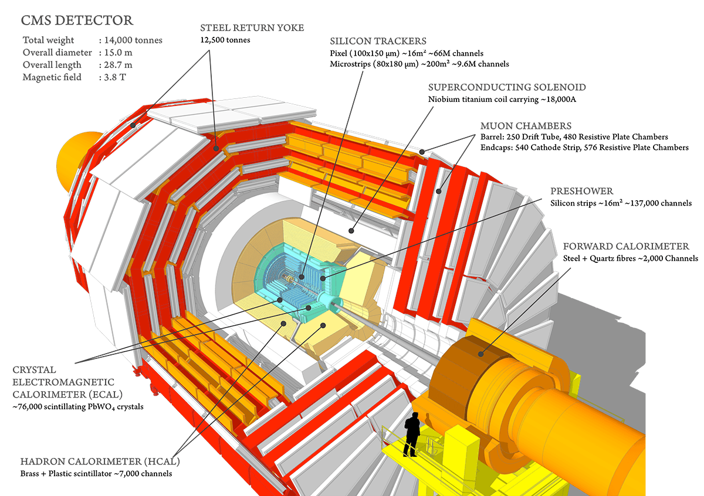

[](https://doi.org/10.5281/zenodo.376533)

## SketchUpCMS

Ruby scripts that read detector geometries in [Detector Description Language (DDL)](https://twiki.cern.ch/twiki/bin/view/CMSPublic/SWGuideDetectorDescription)
 and build 3D models of the detector in [SketchUp](https://www.sketchup.com/).

[](https://cms-docdb.cern.ch/cgi-bin/PublicDocDB/RetrieveFile?docid=11514&filename=cms_160312_02.png&version=3)

* **website:** https://twiki.cern.ch/twiki/bin/view/CMSPublic/SketchUpCMS

### Citation

* Tai Sakuma and Thomas McCauley, "Detector and Event Visualization with SketchUp at the CMS Experiment" <br />
  *J. Phys.: Conf. Ser.* **513** 022032, [doi:10.1088/1742-6596/513/2/022032](http://dx.doi.org/10.1088/1742-6596/513/2/022032)

---

### Quick instructions

As an example, this seciton describes how to build a 3D model of the CMS detector with the [2017 geoetmry](https://github.com/cms-sw/cmssw/blob/CMSSW_9_0_0_pre5/Configuration/Geometry/python/GeometryExtended2017_cff.py).

#### Create a big XML file

First you need to create a big XML file with all CMS detector geoetry.

Follow the instructions at https://github.com/SketchUpCMS/ddtoddl_cfg and create the big XML file `GeometryExtended2017.xml`.

#### Check out

Check out this repo and the graph therory library [GRATR](http://gratr.rubyforge.org/):
```
git clone git@github.com:SketchUpCMS/SketchUpCMS.git
cd SketchUpCMS
git clone git@github.com:SketchUpCMS/gratr.git
```

Copy the big XML file to the directory `SketchUpCMS`. For example, :
```
scp <username>@<address>:<path>/GeometryExtended2017.xml .
```

#### Run

Start SketchUp Pro

Open Ruby Console (Window -> Ruby Console)

Run [`cms_2017.rb`](cms_2017.rb):
```
load '/<some path>/SketchUpCMS/cms_2017.rb'
```

When the script end, you will probaly need to zoom out to find the CMS detector.


